## Лабораторная работа 1
### Топология
0. Архив проекта в файле Lab.zip

1. Построена топология как в задании. Для маршрутизатора и коммутаторов использовались Cisco IOL.  
Схема:
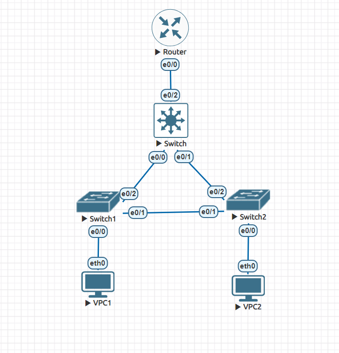

2. Конфигурация нод  
    1. VPC1  
        Установлен ip и gateway, клиент находится в vlan 10 
        ```
        set pcname VPC1
        ip 10.0.10.1/24 10.0.10.2
        ```
        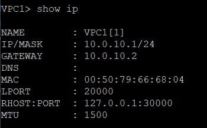
    2. VPC2  

        Установлен ip и gateway, клиент находится в vlan 20 
        ```
        set pcname VPC1
        ip 10.0.20.1/24 10.0.20.2
        ```
        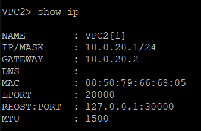
    3. Switch1  
        Для первого коммутатора доступа сначала объявляются vlan 10,20
        ```
        enable
        configure terminal
        vlan 10
        exit
        vlan 20
        exit
        ```
        Для интерфейса между коммутатором и клиентом (e0/0) устанавливается vlan 10
        ```
        interface e0/0
        switchport mode access
        switchport access vlan 10
        exit
        ```
        Для двух других линков (e0/1, e0/2) между коммутаторами устанавливаютсяя допустимые vlan 1,10,20
        ```
        interface e0/1
        switchport trunk encapsulation dot1q
        switchport mode trunk
        switchport trunk allowed vlan 1,10,20
        exit

        interface e0/2
        switchport trunk encapsulation dot1q
        switchport mode trunk
        switchport trunk allowed vlan 1,10,20
        exit
        ```
        Показать допустимые порты для vlan 10:
        ```
        show vlan id 10
        ```
        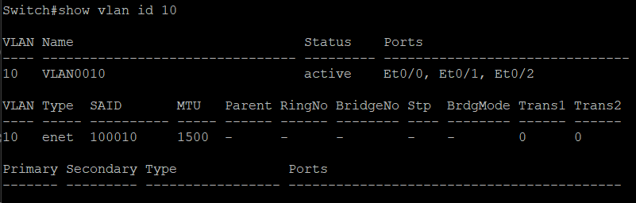

        Показать допустимые порты для vlan 20:
        ```
        show vlan id 20
        ```
        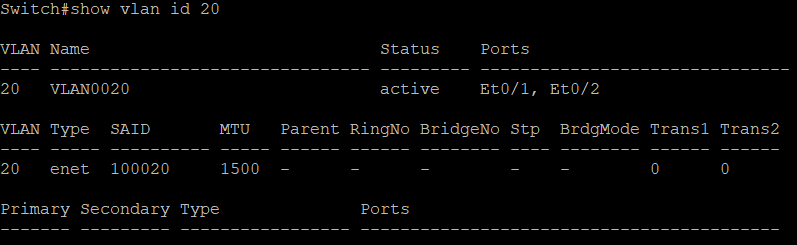

        ```
        show vlan
        ```
        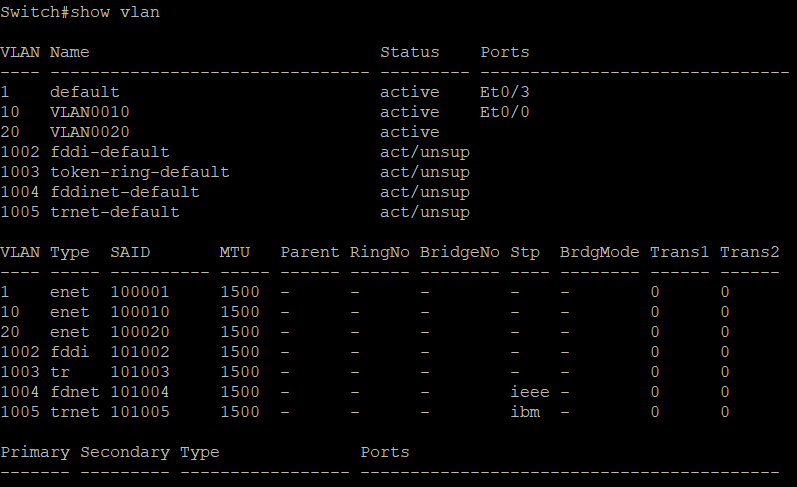

        Видно, что интерфейс e0/0 находится только в vlan 10, что и было нужно

        Для построения дерева задается приоритет, не такой важный как у корня сети и затем сохраняется конфигурация
        ```
        spanning-tree vlan 10,20 priority 20480
        exit
        write memory
        ```

        ```
        show spanning-tree vlan 10
        ```
        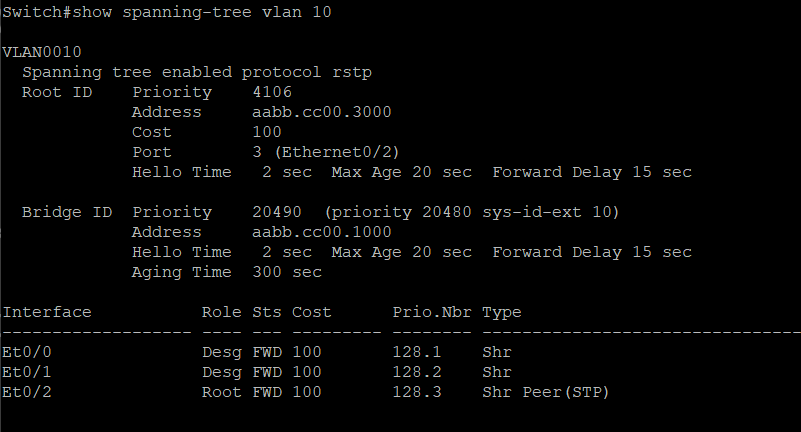
        ```
        show spanning-tree vlan 20
        ```
        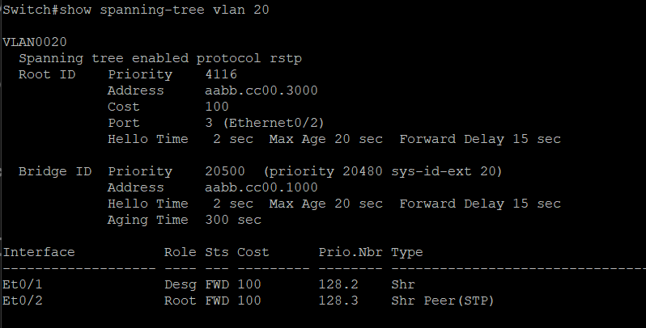
    
    4. Switch2  
        Абсолютно аналогично настраивается второй коммутатор доступа, только уже для vlan 20
        ```
        enable
        configure terminal
        vlan 10
        exit
        vlan 20
        exit
        ```
        Для интерфейса между коммутатором и клиентом (e0/0) устанавливается vlan 20
        ```
        interface e0/0
        switchport mode access
        switchport access vlan 20
        exit
        ```
        Для двух других линков (e0/1, e0/2) между коммутаторами устанавливаютсяя допустимые vlan 1,10,20
        ```
        interface e0/1
        switchport trunk encapsulation dot1q
        switchport mode trunk
        switchport trunk allowed vlan 1,10,20
        exit

        interface e0/2
        switchport trunk encapsulation dot1q
        switchport mode trunk
        switchport trunk allowed vlan 1,10,20
        exit
        ```
        Показать допустимые порты для vlan 10:
        ```
        show vlan id 10
        ```
        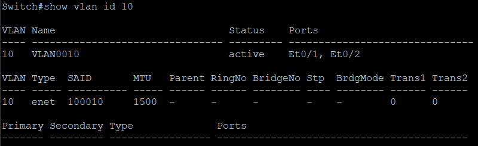

        Показать допустимые порты для vlan 20:
        ```
        show vlan id 20
        ```
        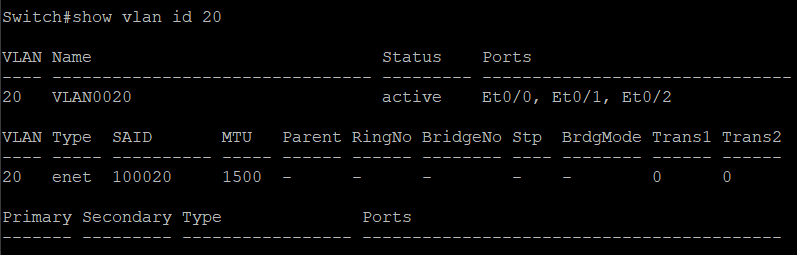

        ```
        show vlan
        ```
        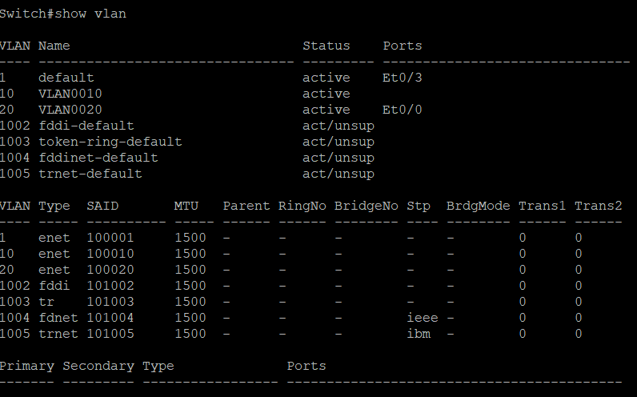

        Видно, что интерфейс e0/0 находится только в vlan 20, что и было нужно

        Для построения дерева задается приоритет, не такой важный как у корня сети и затем сохраняется конфигурация
        ```
        spanning-tree vlan 10,20 priority 20480
        exit
        write memory
        ```

        ```
        show spanning-tree vlan 10
        ```
        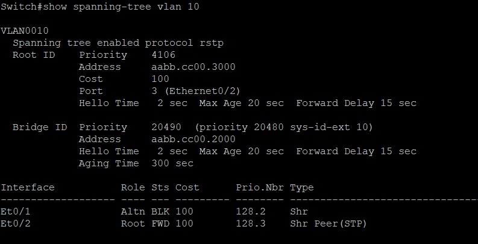
        ```
        show spanning-tree vlan 20
        ```
        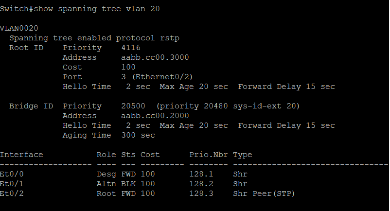
        
        Линк между двумя коммутаторами Switch1 и Switch2 (e0/1 - e0/1) является заблокированным (Et0/1               Altn BLK 100       128.2    Shr)
        
    5. Switch  
        Сначала объявляются vlan 10,20
        ```
        enable
        configure terminal
        vlan 10
        exit
        vlan 20
        exit
        ```
        Затем настраиваются все три интерфейса(e0/0, e0/1, e0/2) на vlan 1,10,20

        ```
        interface e0/0
        switchport trunk encapsulation dot1q
        switchport mode trunk
        switchport trunk allowed vlan 1,10,20
        exit

        interface e0/1
        switchport trunk encapsulation dot1q
        switchport mode trunk
        switchport trunk allowed vlan 1,10,20
        exit

        interface e0/2
        switchport trunk encapsulation dot1q
        switchport mode trunk
        switchport trunk allowed vlan 1,10,20
        exit
        ```
        Показать допустимые порты для vlan 10:
        ```
        show vlan id 10
        ```
        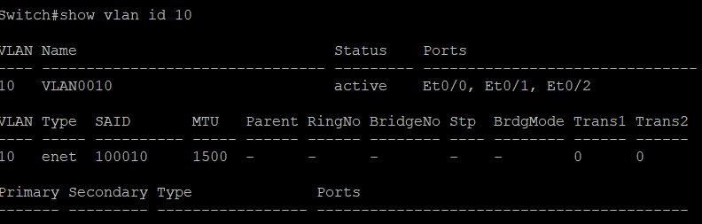

        Показать допустимые порты для vlan 20:
        ```
        show vlan id 20
        ```
        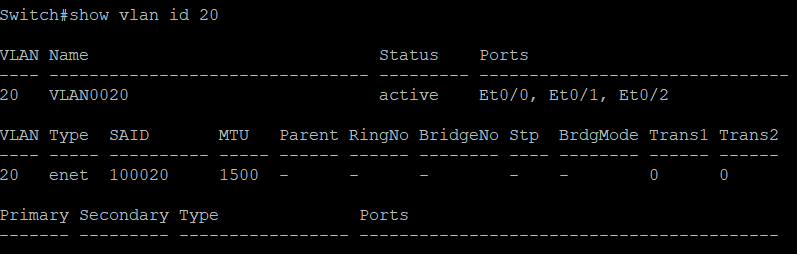

        ```
        show vlan
        ```
        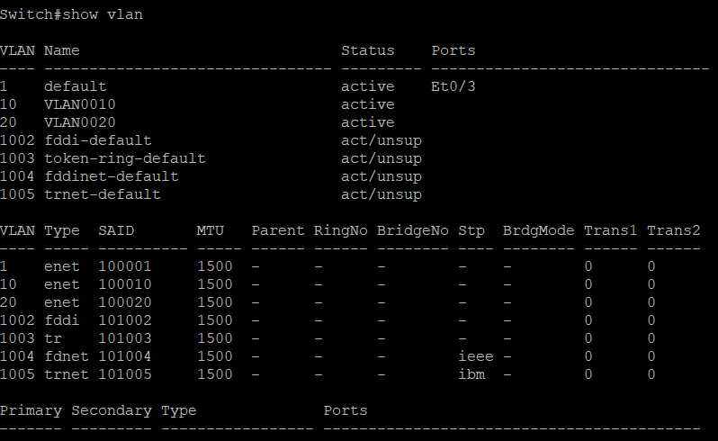

        Далее в дереве указывается, что это корень для vlan 10,20 с помощью priority - оно самое маленькое среди всех коммуникаторов, а значит наивысшая важность у него. Затем сохраняется конфигурация
        ```
        spanning-tree vlan 10,20 priority 4096
        exit
        write memory
        ```

        ```
        show spanning-tree vlan 10
        ```
        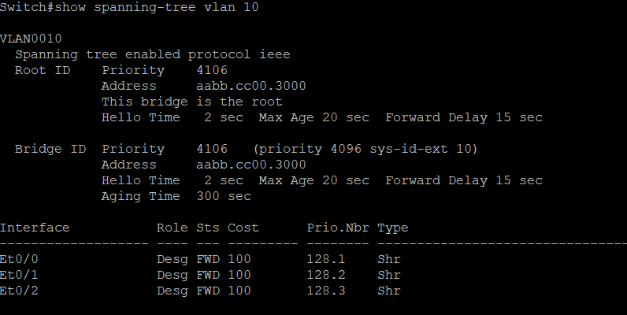
        ```
        show spanning-tree vlan 20
        ```
        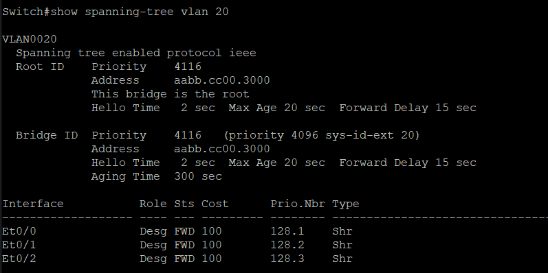
        Для обоих vlan'ов Switch является корнем ( This bridge is the root)

    6. Router  
        Сначала включается интерфейс между коммутатором и маршрутизатором (e0/0)
        ```
        enable
        configure terminal
        interface e0/0
        no shutdown
        exit
        ```

        Далее настраиваются сабинтерфейсы на ip двоих клиентов VPC

        ```
        interface e0/0.1
        encapsulation dot1Q 10
        ip address 10.0.10.2 255.255.255.0
        exit

        interface e0/0.2
        encapsulation dot1Q 20
        ip address 10.0.20.2 255.255.255.0
        exit
        ```
        Затем сохраняется конфигурация

        ```
        exit
        write memory
        ```
3. Проверка на ping  
    1. VPC1  
        Отправка пинга с первого клиента второму (VPC1 -> VPC2)
        ```
        ping 10.0.20.1 -c 1
        ``` 
        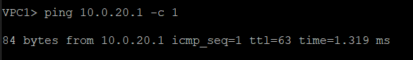

        Отправка пинга с первого клиента первому (VPC1 -> VPC1)
        ```
        ping 10.0.10.1 -c 1
        ``` 
        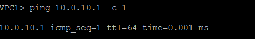
        Все дошло
    1. VPC2  
        Отправка пинга со второго клиента первому (VPC2 -> VPC1)
        ```
        ping 10.0.10.1 -c 1
        ``` 
        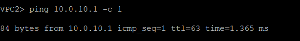

        Отправка пинга со второго клиента второму (VPC2 -> VPC2)
        ```
        ping 10.0.20.1 -c 1
        ``` 
        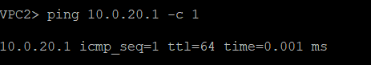
        Все дошло

4. Проверка отказоустойчивости 

    1. Отключение линка между Switch1 и Switch (e0/2 - e0/0)  
        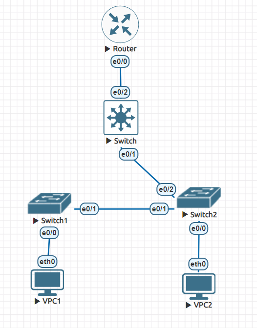
        
        1. VPC1  
            ```
            VPC1> ping 10.0.20.1 -c 2

            84 bytes from 10.0.20.1 icmp_seq=1 ttl=63 time=2.147 ms
            84 bytes from 10.0.20.1 icmp_seq=2 ttl=63 time=1.154 ms

            VPC1> ping 10.0.10.1 -c 2

            10.0.10.1 icmp_seq=1 ttl=64 time=0.001 ms
            10.0.10.1 icmp_seq=2 ttl=64 time=0.001 ms

            ```            
        1. VPC2  
            ``` 
            VPC2> ping 10.0.10.1 -c 2

            84 bytes from 10.0.10.1 icmp_seq=1 ttl=63 time=2.246 ms
            84 bytes from 10.0.10.1 icmp_seq=2 ttl=63 time=0.609 ms

            VPC2> ping 10.0.20.1 -c 2

            10.0.20.1 icmp_seq=1 ttl=64 time=0.001 ms
            10.0.20.1 icmp_seq=2 ttl=64 time=0.001 ms
            ``` 
        Все дошло
    2. Отключение линка между Switch2 и Switch (e0/2 - e0/1)  
        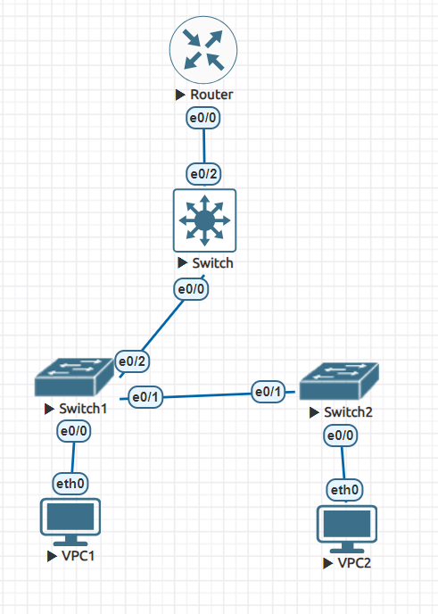

        1. VPC1  
            ```
            VPC1> ping 10.0.20.1 -c 3

            84 bytes from 10.0.20.1 icmp_seq=1 ttl=63 time=0.791 ms
            84 bytes from 10.0.20.1 icmp_seq=2 ttl=63 time=1.014 ms
            84 bytes from 10.0.20.1 icmp_seq=3 ttl=63 time=0.873 ms

            VPC1> ping 10.0.10.1 -c 3

            10.0.10.1 icmp_seq=1 ttl=64 time=0.001 ms
            10.0.10.1 icmp_seq=2 ttl=64 time=0.001 ms
            10.0.10.1 icmp_seq=3 ttl=64 time=0.001 ms
            ```            
        1. VPC2  
            ```  
            VPC2> ping 10.0.10.1 -c 3

            84 bytes from 10.0.10.1 icmp_seq=1 ttl=63 time=0.984 ms
            84 bytes from 10.0.10.1 icmp_seq=2 ttl=63 time=1.235 ms
            84 bytes from 10.0.10.1 icmp_seq=3 ttl=63 time=1.337 ms

            VPC2> ping 10.0.20.1 -c 3

            10.0.20.1 icmp_seq=1 ttl=64 time=0.001 ms
            10.0.20.1 icmp_seq=2 ttl=64 time=0.001 ms
            10.0.20.1 icmp_seq=3 ttl=64 time=0.001 ms
            ``` 
        Все дошло
    3. Отключение линка между Switch1 и Switch2 (e0/1 - e0/1)  
        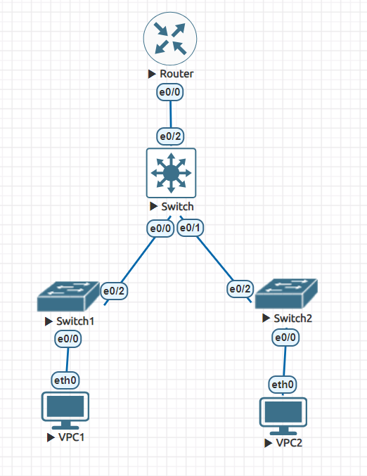

        1. VPC1  
            ```             
            VPC1> ping 10.0.20.1 -c 1

            84 bytes from 10.0.20.1 icmp_seq=1 ttl=63 time=1.584 ms

            VPC1> ping 10.0.10.1 -c 1

            10.0.10.1 icmp_seq=1 ttl=64 time=0.001 ms
            ```            
        1. VPC2  
            ```  
            VPC2> ping 10.0.10.1 -c 1

            84 bytes from 10.0.10.1 icmp_seq=1 ttl=63 time=1.446 ms

            VPC2> ping 10.0.20.1 -c 1

            10.0.20.1 icmp_seq=1 ttl=64 time=0.001 ms
            ``` 
        Все дошло


    


    


